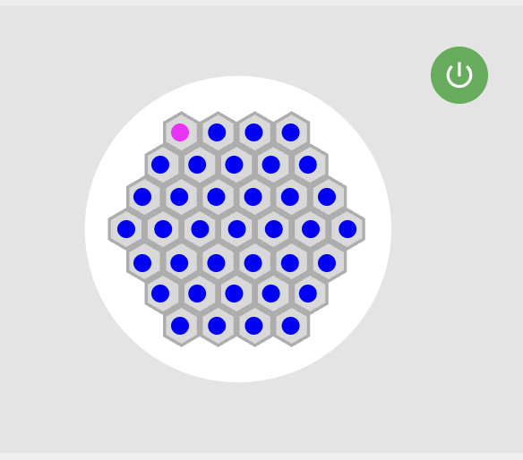

# GridLights Mobile App - TODO List

## Big Meat 🍖
- [ ] Pull list of effects from WLED
- [ ] Implementing Journeys

## Little Meat 🥩

- [x] ~~Frequency slider should be 0-60, not 0-100~~ - **IGNORE** (Already is 0-60)
- [x] Little indicator LED next to the IP type-in to indicate websocket status
- [x] ~~Change the white circle background (BUG2.png) to a white hexagon~~ - **DONE**

## Little Bugs 🐛

- [x] Remove "Color Order" component from Settings page (why color order?)
- [ ] Corner LED is on the visual (see BUG2.png)
- 
- [ ] The red LEDs popping up don't actually display
- [ ] No colors in live preview - Make all LED components white (they're currently blue)

## App Features
- [ ] Automating the discovery process with mDNS - **BACKBURNER**
